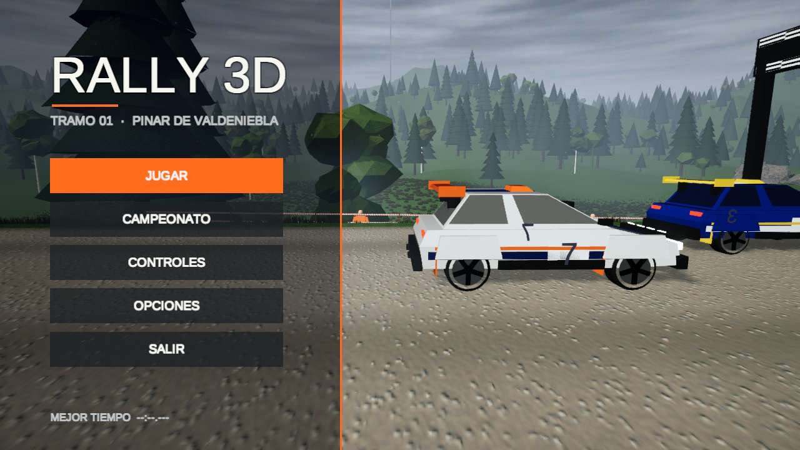
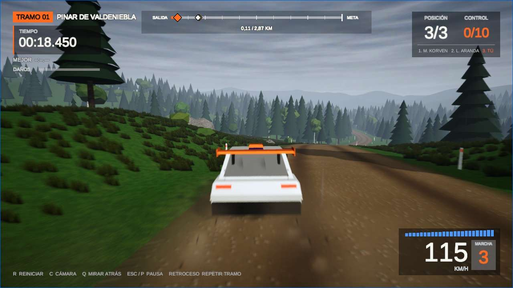
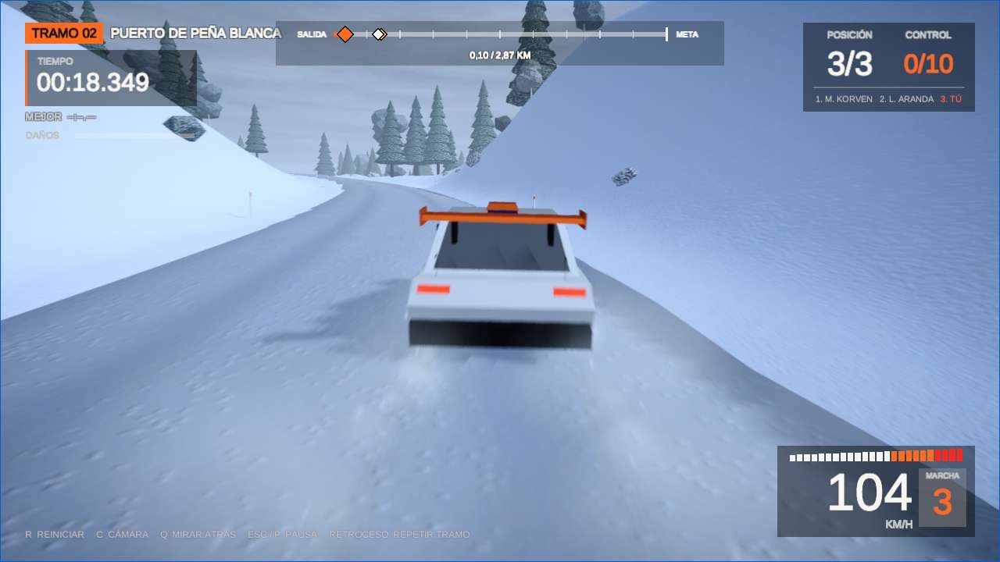
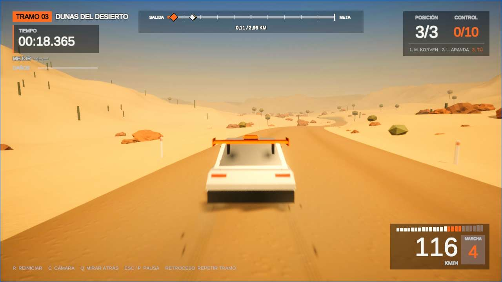
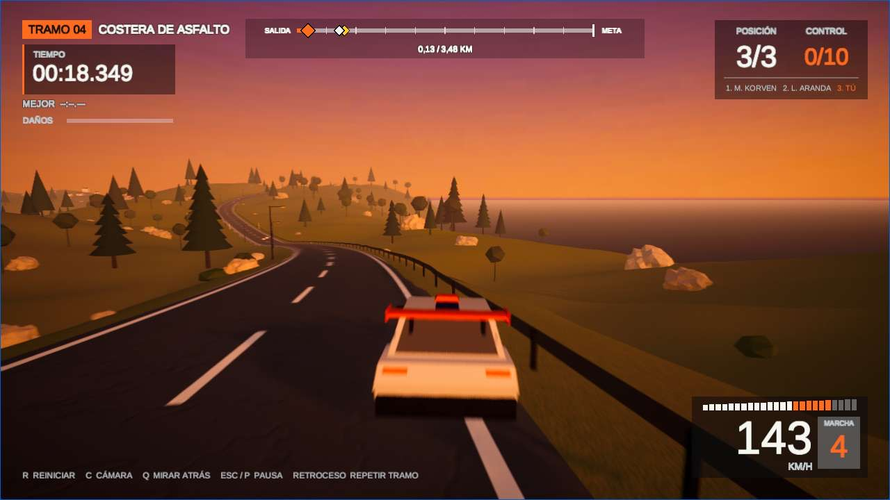
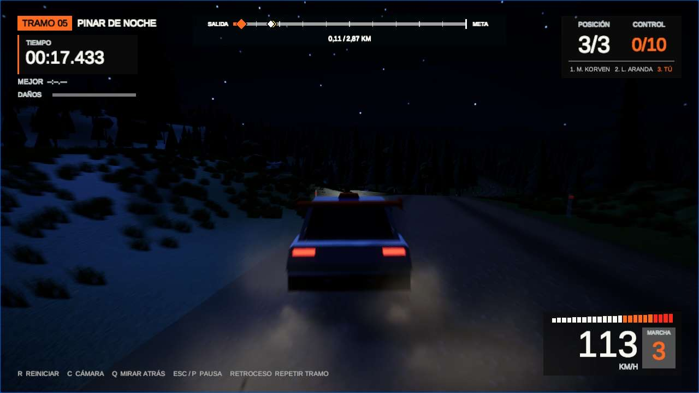
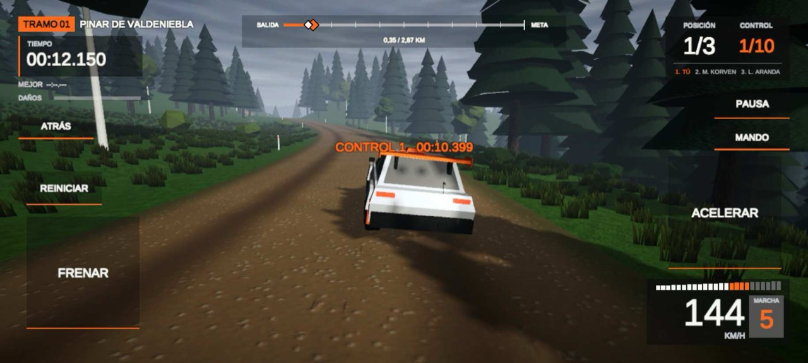
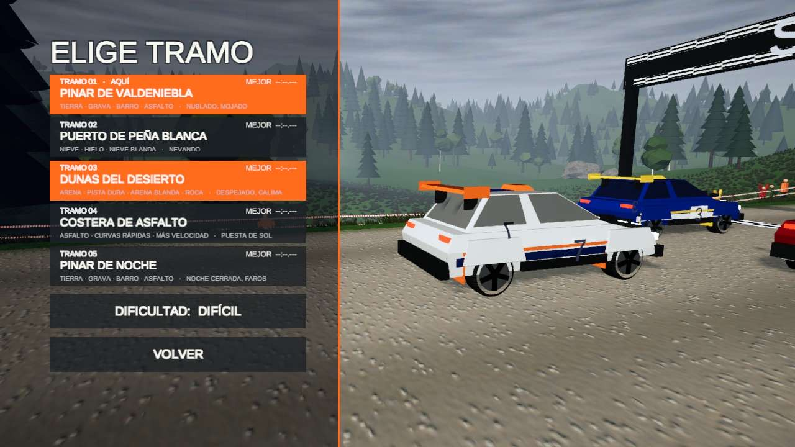

# Rally 3D

Juego de rally arcade-realista para **PC y navegador (también móvil)**, hecho con **Unity 6 (6000.0.84f1)**, **URP 17**
y el **Input System**. Todo se genera por código: terreno, carreteras, texturas, vegetación, coches, cielo, música y
sonidos. No usa assets de terceros. La versión web está preparada para **itch.io**.



| Tramo 01 · Pinar de Valdeniebla | Tramo 02 · Puerto de Peña Blanca |
|---|---|
|  |  |
| **Tramo 03 · Dunas del Desierto** | **Tramo 04 · Costera de Asfalto** |
|  |  |

| **Tramo 05 · Pinar de Noche** | **En el móvil** |
|  |  |



## Tramos

| Tramo | Superficie | Ambiente | Lo especial |
|---|---|---|---|
| **01 · Pinar de Valdeniebla** (2,9 km) | Tierra, grava, barro y un pueblo con asfalto | Nublado y mojado, llovizna | Tres saltos; ovejas en la carretera |
| **02 · Puerto de Peña Blanca** (2,9 km) | Nieve pisada, hielo y nieve blanda | Nevando | Poco agarre; la IA frena antes |
| **03 · Dunas del Desierto** (3,0 km) | Pista de arena dura, hamada y arena blanda | Despejado con calima | Fuera de la pista, arena suelta que frena mucho |
| **04 · Costera de Asfalto** (3,5 km) | Asfalto nuevo con mucho agarre | Puesta de sol junto al mar | Velocidad máxima más alta (213 km/h), farolas, guardarraíles, señales de curva y ovejas |
| **05 · Pinar de Noche** (2,9 km) | Como el tramo 01 | Noche con luna y estrellas | Faros en todos los coches |

## Cómo se juega

- **JUGAR:** eliges tramo y coche y corres contra dos rivales, o solo contra el reloj si desactivas los rivales.
  Hay **cinco coches**, entre ellos LEYENDA #1 (tracción trasera) y GRUPO B #9 (muy potente).
- **CAMPEONATO:** los cinco tramos seguidos, con el tiempo de cada piloto sumado. Tras cada tramo ves la clasificación
  general. No se pueden repetir tramos. Si ganas, eres campeón.
- **Reglas:**
  - Reiniciar en la pista (R) suma **+5 s**.
  - Si te sales lejos de la carretera, una **cuenta atrás roja de 5 s** te devuelve a ella, sin penalización.
  - Los choques **abollan el coche**, le quitan potencia y desvían la dirección.
  - Paredes invisibles en el borde del mapa.
- **Ayudas:**
  - El **copiloto** canta las curvas (grado 1 a 6, horquillas y saltos) en pantalla y con voz.
  - El **coche fantasma** reproduce tu mejor vuelta en cada tramo.
- **Al terminar:**
  - Al ganar, «¡VICTORIA!» con fanfarria, vítores del público y confeti.
  - **REPETICIÓN** de la carrera con cámaras de televisión.
  - Tu puesto en la **tabla de tiempos** del tramo.
- **TIEMPOS:** los 10 mejores de cada tramo, con tu nombre de piloto. Se guardan en el dispositivo y pueden ser una
  tabla mundial si montas el servidor incluido (ver [docs/CLASIFICACION_ONLINE.md](docs/CLASIFICACION_ONLINE.md)).

## Controles

| Acción | Teclado | Mando |
|---|---|---|
| Acelerar / frenar y marcha atrás | W / S (o ↑ / ↓) | RT / LT |
| Girar | A D (o ← →) | Stick izquierdo |
| Freno de mano | Espacio | B o RB |
| Reiniciar en la pista | R | Y |
| Cámara (4 vistas) | C | View / Share |
| Mirar atrás | Q (mantener) | Stick derecho hacia abajo |
| Mirar alrededor | — | Stick derecho en cualquier dirección |
| Pausa | Esc (en el navegador también P) | Start |
| Repetir tramo | Retroceso | X |

En los menús, el stick izquierdo y la cruceta mueven la selección y la lista da la vuelta de abajo arriba.

**Móvil (navegador, en horizontal):**
- **Modo BOTONES:** giras inclinando el móvil y tienes ACELERAR, FRENAR, REINICIAR y ATRÁS en pantalla.
- **Modo MANDO:** joystick y botones A/B/X/Y en pantalla. Se cambia de modo con el botón bajo PAUSA.
- Si el navegador no da datos de inclinación, aparecen botones IZQUIERDA / DERECHA. Brave bloquea los sensores; usa Chrome.

## Opciones

| Opción | Valores (por defecto) |
|---|---|
| Dificultad | FÁCIL (móvil) · NORMAL (PC) · DIFÍCIL |
| Ayuda de conducción | NO (PC) · MEDIA (móvil) · ALTA. Sigue la carretera y frena antes de las curvas |
| Calidad gráfica | BAJA · MEDIA (móvil) · ALTA (PC) |
| Fantasma | SÍ · NO |
| Daños | COMPLETOS · SOLO VISUALES · DESACTIVADOS |
| Copiloto | VOZ Y TEXTO · SOLO TEXTO · DESACTIVADO |
| Rivales | SÍ · NO (contra el reloj) |
| Volumen | 100 · 75 · 50 · 25 · 0 % |
| Solo móvil | Sensibilidad de la inclinación · Acelerar solo (activado por defecto) |

## Compilar y publicar

- **Editor:** abre `Assets/Scenes/Stage01.unity` y pulsa Play.
- **Regenerar un tramo:** menú **Rally ▸ Build Stage (full)** (y *Build Snow Stage 02*, *Build Desert Stage 03*, *Build Coast Stage 04*,
  *Build Night Stage 05*).
  Genera primero el tramo 01, porque los demás usan sus coches.
- **Build web:**
  ```bash
  rm -rf ~/Desktop/Rally3D_Web
  unity build . --target WebGL --execute-method Rally.EditorTools.WebBuild.Build \
    -o ~/Desktop/Rally3D_Web --editor-version 6000.0.84f1
  cd ~/Desktop/Rally3D_Web && zip -r ../Rally3D_Web.zip index.html Build TemplateData StreamingAssets -x "*.DS_Store"
  ```
- **itch.io:**
  - *Kind of project* = HTML. Sube el zip y marca *This file will be played in the browser*.
  - Tamaño 1280 × 720, con *Fullscreen button* y *Mobile friendly* en horizontal.
  - Los archivos del build llevan un nombre único en cada versión, así que tras subir una nueva basta con recargar la página.
- **Tamaño y carga:**
  - El tramo 01, con el menú, va en la descarga inicial: 31 MB, que cargan en unos 15 s a 20 Mbps.
  - Los tramos 02–05 se descargan al elegirlos (15–17 MB cada uno) desde `StreamingAssets`, con pantalla de carga.
  - El zip debe incluir esa carpeta.

## Pruebas

**35 tests de PlayMode y 2 de EditMode**, todos en verde. Se ejecutan en batch sin abrir el Editor:

```bash
unity test . --mode PlayMode
unity test . --mode EditMode
```

| Área | Tests |
|---|---|
| Reinicios, penalización, vuelco y cuenta atrás | QA01, QA02, QA03, QA06, QA24 |
| Daños, golpes y empujes entre coches | QA07, QA11, QA12 |
| Copiloto y notas | QA08, QA09 |
| Tramos (nieve, desierto, costa) y terreno bajo la carretera | QA10, QA14, QA15, QA16 |
| Cámara y mirar alrededor | QA13, QA18 |
| Ovejas y objetos de la cuneta | QA17, QA21, QA23 |
| Menús, mando y resultados | QA04, QA19 |
| Límites del mapa, ayuda de conducción y calidad gráfica | QA20, QA25, QA26 |
| Campeonato, fantasma, repetición y celebración | QA22, QA27, QA28, QA30 |
| Coches nuevos, tramo nocturno y tabla de tiempos | QA29, QA31, QA32 |
| Build listo para publicar (EditMode) | QA05 |

Además, el build web se prueba en Chrome automatizado, en PC y con un Android emulado (táctil, acelerómetro y red
limitada).

**Pendiente de probar en dispositivos reales:** iPhone (permiso de movimiento de Safari), mando físico en el navegador y
móviles de gama baja.

## Código (`Assets/Scripts`)

| Carpeta | Qué hay |
|---|---|
| `Car/` | Física del coche, entrada del jugador, daños, ayuda de conducción, contacto entre coches |
| `AI/` | Pilotos rivales: trazada, perfil de velocidad, dificultad, errores y reacción a los golpes |
| `Systems/` | Carrera, carga de tramos, campeonato, fantasma, repetición, tabla de tiempos, dificultad, calidad gráfica, faros, entrada |
| `Track/` | Recorrido, generación del terreno, notas del copiloto, ovejas, objetos derribables |
| `UI/` | HUD, menús, controles táctiles, celebración, navegación con mando |
| `Camera/`, `Audio/`, `VFX/` | Cámaras, sonido sintetizado, polvo, marcas, clima y efectos |
| `Editor/` | Generadores de tramos, texturas, materiales, vegetación y coches; Addressables y build web |
| `server/` (raíz) | Servidor opcional de la tabla mundial (Cloudflare Worker) |

El registro detallado de lo que se ha hecho, cómo se ha medido y por qué está en [docs/HISTORIAL.md](docs/HISTORIAL.md).
Las reglas de trabajo del proyecto están en [CLAUDE.md](CLAUDE.md).
