# Rally 3D

Cuatro tramos: **Tramo 01 «Pinar de Valdeniebla»** (tierra, pinar y lluvia), **Tramo 02 «Puerto de Peña Blanca»** (nieve y hielo),
**Tramo 03 «Dunas del Desierto»** (arena, rocas y calima) y **Tramo 04 «Costera de Asfalto»** (asfalto rápido junto al mar, al atardecer).

Prototipo de rally arcade-realista hecho con **Unity 6 (6000.0.84f1)**, **URP 17** y el **Input System**.
Todo (terreno, carretera, texturas, árboles, decorado, coches, cielo y sonidos) se genera por código:
no usa assets de terceros.

Se juega en **PC** (teclado o mando) y en el **navegador**, también en **móvil** (inclinación del teléfono,
botones táctiles o mando en pantalla). La versión web está preparada para publicarse en **itch.io**.

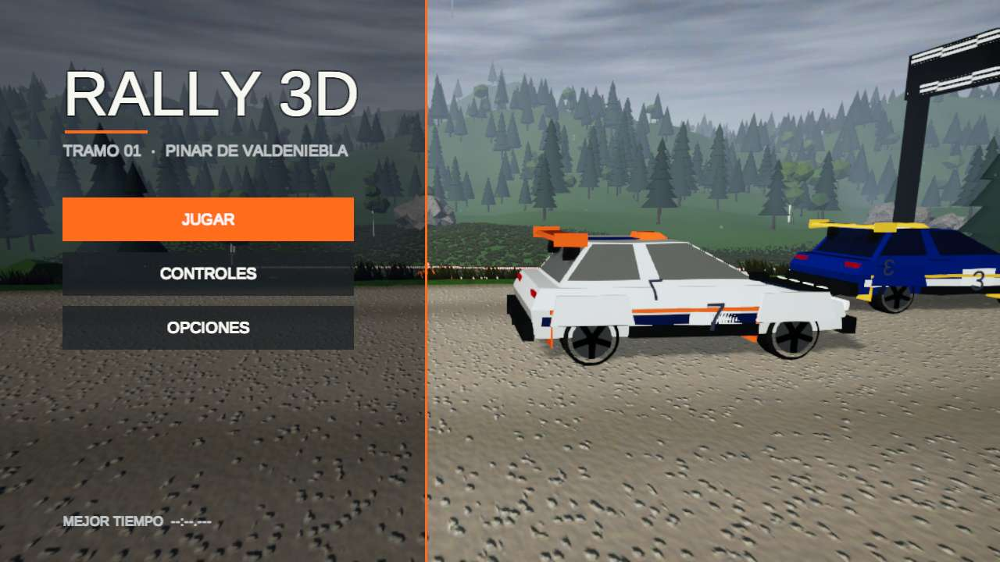

## Capturas

| Tramo 02 — nieve: salida | Tramo 02 — nieve: en carrera |
|---|---|
| 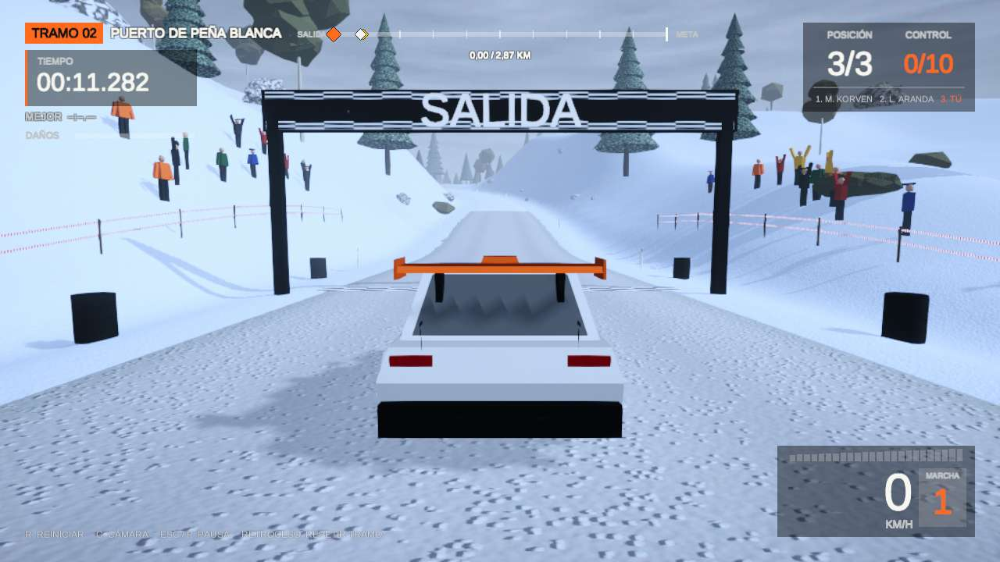 | 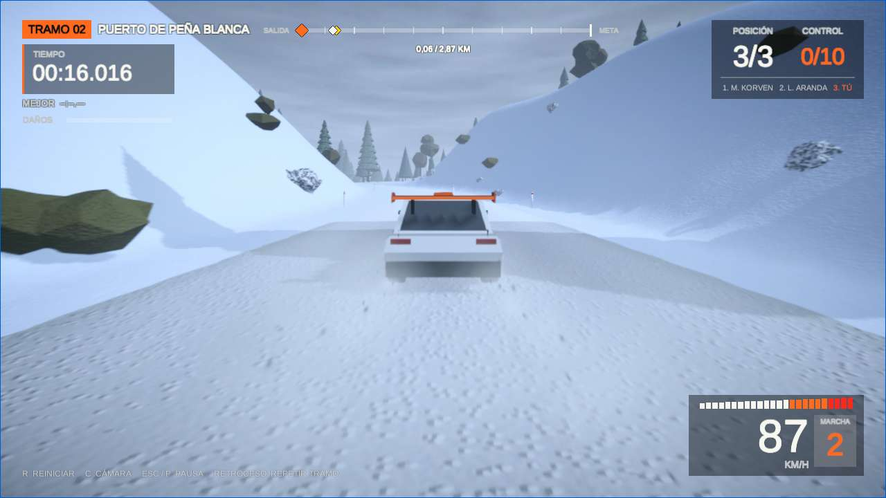 |

| Elegir tramo | Salir del juego (en el navegador) |
|---|---|
| 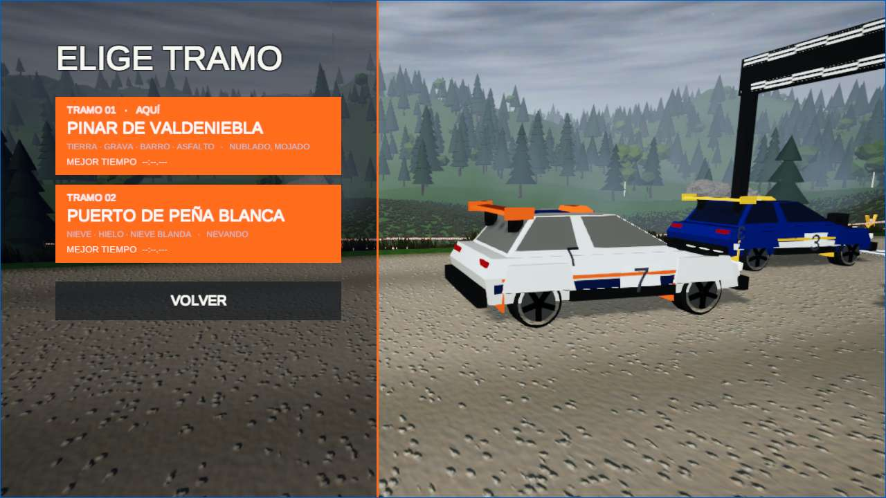 | 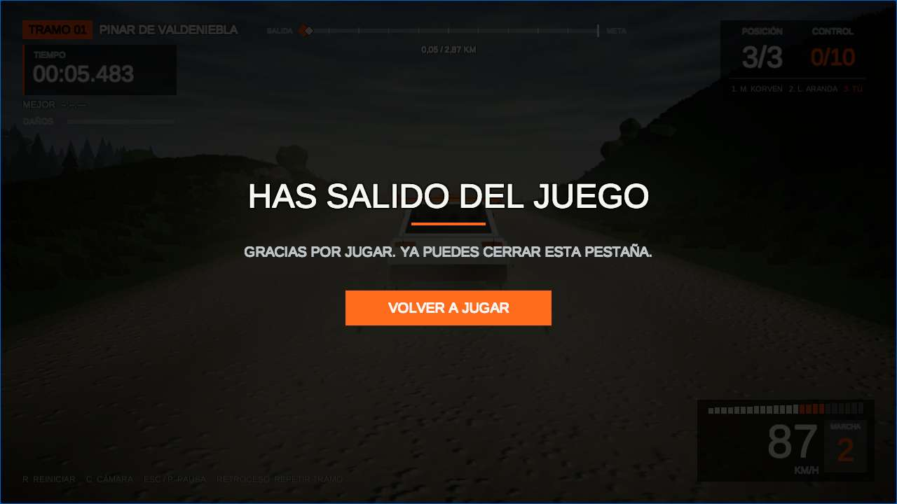 |

| Elegir coche | Copiloto: notas de curva |
|---|---|
| 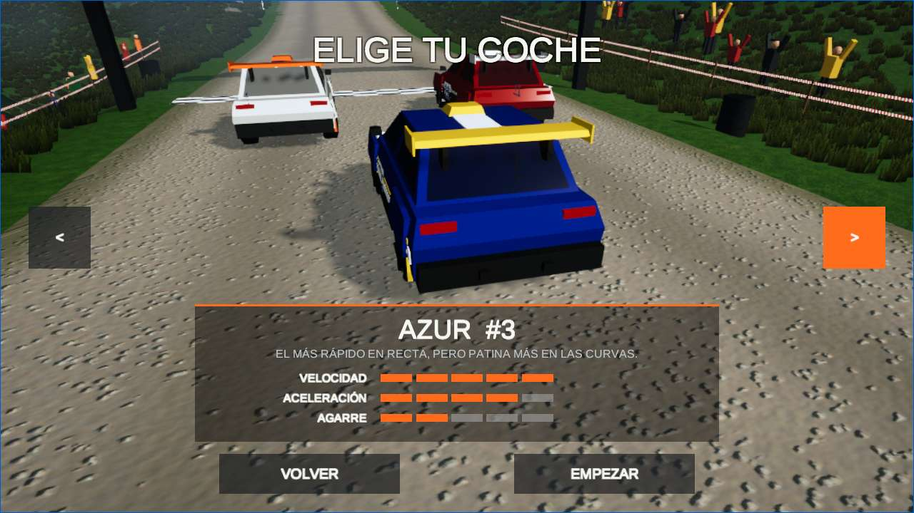 | 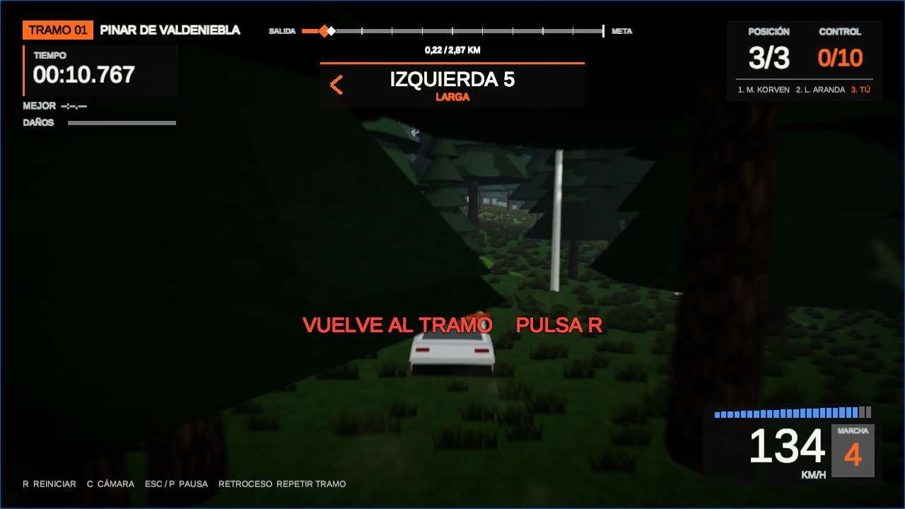 |

| Daños y penalización (+5 s al reiniciar) | Pausa con SALIR AL MENÚ |
|---|---|
| 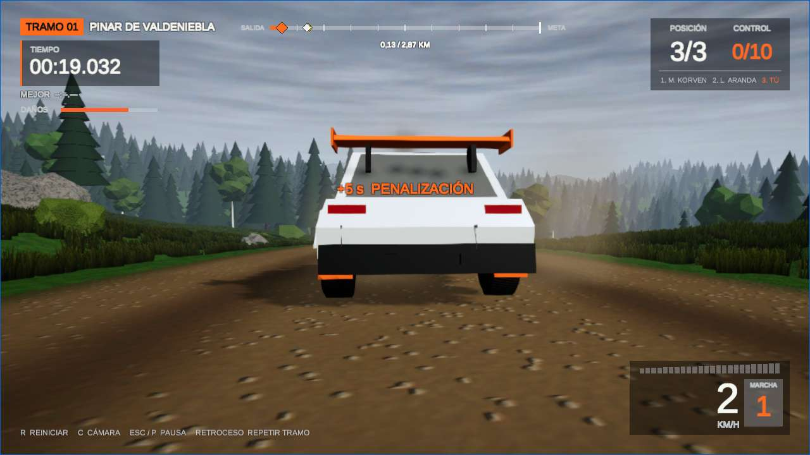 | 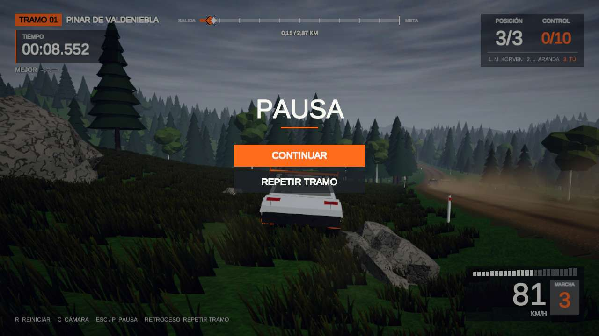 |

| En carrera detrás de los rivales | Controles |
|---|---|
| 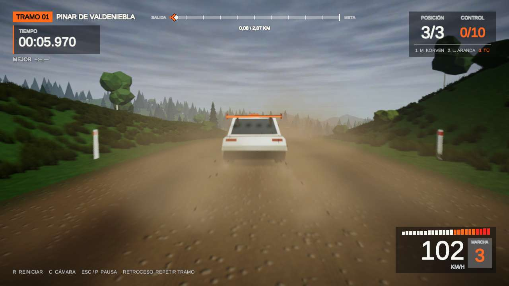 | 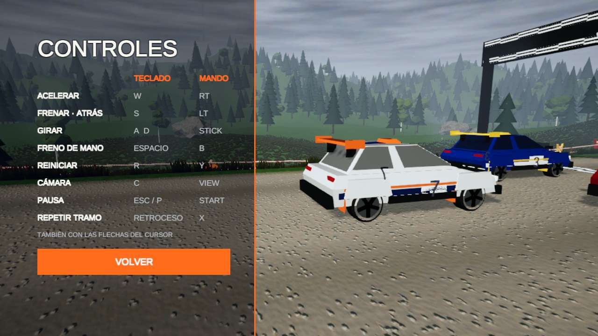 |

| Móvil — inicio | Móvil — botones + inclinación |
|---|---|
| 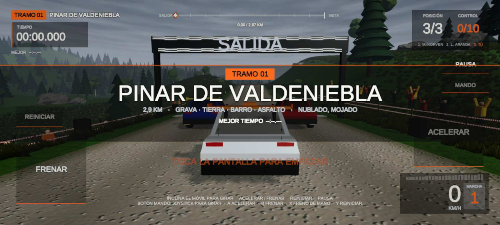 | 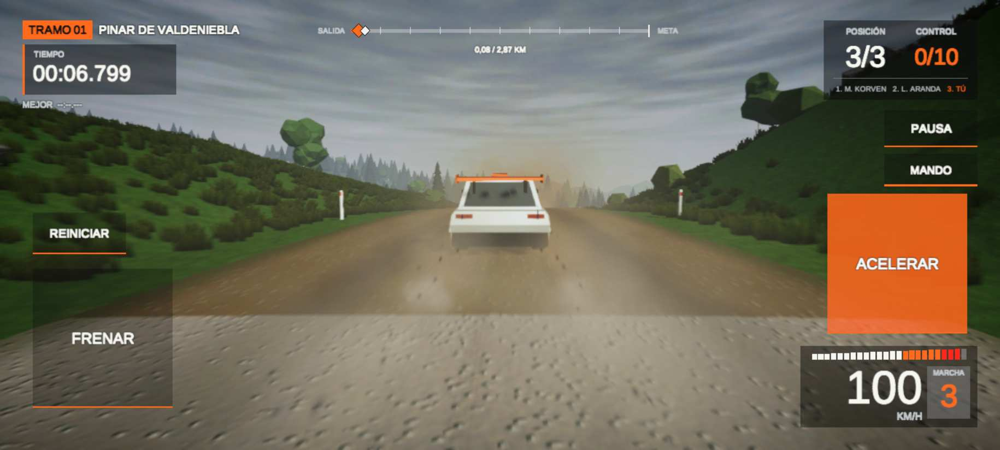 |

| Móvil — modo MANDO | Móvil — pausa (sensibilidad y diagnóstico del sensor) |
|---|---|
| 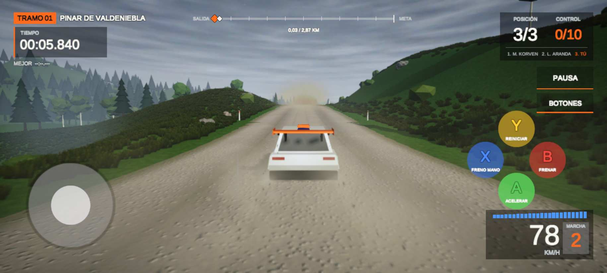 | 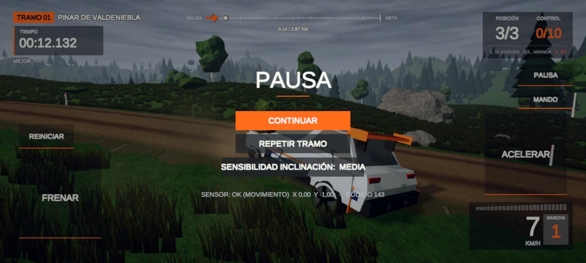 |

| Móvil — opciones | Móvil sin sensor de inclinación (aparecen IZQUIERDA / DERECHA) |
|---|---|
| 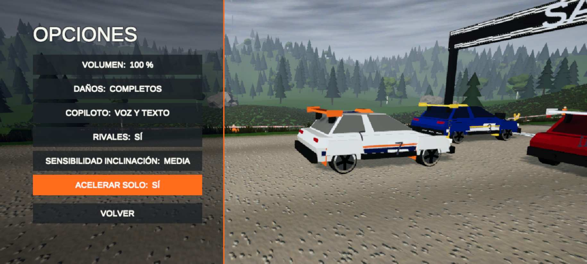 | 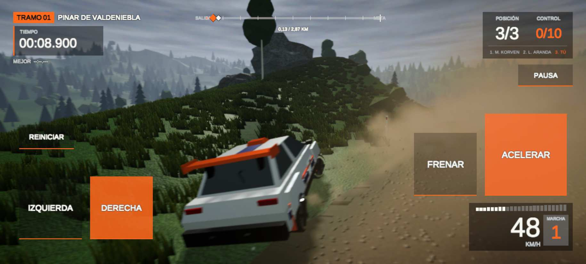 |

> Las capturas de móvil están hechas en un Android simulado (Chrome, 915×412 en horizontal).

## Cómo se juega

1. **Menú principal:** JUGAR, CONTROLES, OPCIONES y SALIR.
   En el navegador, SALIR detiene el juego y muestra «Has salido del juego», porque una página no puede cerrar su pestaña.
2. **JUGAR → elige tramo → elige tu coche** con las flechas y pulsa EMPEZAR. Hay tres coches:
   - **VALDENIEBLA #7**, equilibrado.
   - **AZUR #3**, el más rápido pero con menos agarre.
   - **CARMESÍ #11**, con mucho agarre y menos punta.

   Cada coche tiene decoración y prestaciones propias. El juego recuerda tu elección, también al usar REPETIR TRAMO.
3. **Durante el tramo:**
   - El **copiloto** avisa de cada curva (de 1, la más cerrada, a 6, la más rápida), de las **horquillas** y de los **saltos**.
     Lo hace en pantalla y, en el navegador, con voz en castellano.
   - Si **reinicias** (R), se suman **+5 s**.
   - En cada control ves la **diferencia con tu mejor tiempo**: verde si vas más rápido, rojo si vas más lento.
   - Los **choques abollan el coche**, le quitan potencia y hacen que la dirección tire hacia el lado dañado.
     Reiniciar no repara el coche; repetir el tramo, sí.
4. **Pausa:** CONTINUAR, REPETIR TRAMO, **SALIR AL MENÚ**, **SALIR DEL JUEGO** (y la sensibilidad de la inclinación en el móvil).

### Opciones

| Opción | Valores |
|---|---|
| Volumen | 100 / 75 / 50 / 25 / 0 % |
| Dificultad | FÁCIL (por defecto en el móvil) · NORMAL (por defecto en PC) · DIFÍCIL |
| Daños | COMPLETOS · SOLO VISUALES · DESACTIVADOS |
| Copiloto | VOZ Y TEXTO · SOLO TEXTO · DESACTIVADO |
| Rivales | SÍ · NO (contra el reloj, como en un rally real) |
| Sensibilidad inclinación (móvil) | BAJA · MEDIA · ALTA · MUY ALTA |
| Acelerar solo (móvil) | SÍ · NO: el coche acelera solo salvo cuando frenas |

## Controles

### PC

| Acción | Teclado | Mando (Xbox / PlayStation) |
|---|---|---|
| Acelerar | W / ↑ | RT / R2 |
| Frenar / marcha atrás | S / ↓ | LT / L2 |
| Girar | A D / ← → | Stick izquierdo |
| Freno de mano | Espacio | B / Círculo o RB / R1 |
| Reiniciar en la pista | R | Y / Triángulo |
| Cámara (persecución / lejana / capó / paragolpes) | C | View / Share |
| Pausa | Esc (en el navegador también **P**) | Start / Options |
| Repetir tramo | Retroceso | X / Cuadrado |
| Mirar atrás (mantener) | Q (↓ ya es frenar) | Stick derecho hacia abajo |
| Mirar alrededor | — | Stick derecho en cualquier dirección (arriba: delante; derecha: a la derecha; abajo: detrás…) |
| Empezar / confirmar | Enter (en el navegador también **clic**) | A / Cruz |

En el navegador, **P** también pausa porque a pantalla completa el navegador usa Esc para salir de ella.

### Móvil (navegador)

Toca la pantalla para empezar. Hay **dos modos**, y se cambia entre ellos con el botón que hay bajo **PAUSA**.
El juego recuerda el modo elegido.

| Modo | Girar | Acelerar | Frenar | Otros |
|---|---|---|---|---|
| **BOTONES** | Inclinar el móvil | ACELERAR | FRENAR | REINICIAR, PAUSA |
| **MANDO** | Joystick en pantalla | **A** (verde) | **B** (rojo) | **X** freno de mano (azul), **Y** reiniciar (amarillo) |

- **Inclinación:** al salir, y al volver de la pausa, la postura del móvil cuenta como «recto».
  La sensibilidad se cambia en **PAUSA → SENSIBILIDAD INCLINACIÓN**: BAJA, MEDIA, ALTA o MUY ALTA.
- **Sin sensor:** si el navegador no da datos de inclinación, a los 2 s aparecen **IZQUIERDA / DERECHA**.
  **Brave bloquea los sensores de movimiento**; usa Chrome, o el modo MANDO.
- **Mirar atrás:** mantén el botón **ATRÁS** (arriba a la izquierda); al soltarlo la cámara vuelve suavemente.
- **Diagnóstico:** en **PAUSA** aparece una línea `SENSOR: …` con el estado del sensor, para saber por qué no funciona la inclinación.

## Jugar y compilar

- **Editor:** abre `Assets/Scenes/Stage01.unity` y pulsa Play. Haz clic en la vista Game para que tenga el foco.
- **Build web desde la línea de comandos:**
  ```bash
  unity build . --target WebGL --execute-method Rally.EditorTools.WebBuild.Build \
    -o ~/Desktop/Rally3D_Web --editor-version 6000.0.84f1
  ```
  También se puede hacer desde **File ▸ Build Profiles ▸ Web ▸ Build**.

### Publicar en itch.io

1. Comprime **el contenido** de la carpeta del build, de modo que `index.html`, `Build/` y `TemplateData/`
   queden en la raíz del zip y no dentro de otra carpeta:
   ```bash
   cd ~/Desktop/Rally3D_Web && zip -r ../Rally3D_Web.zip index.html Build TemplateData -x "*.DS_Store"
   ```
2. En itch.io: **Kind of project = HTML**, sube el zip y marca **This file will be played in the browser**.
3. En **Embed options**: tamaño **1280 × 720**, activa **Fullscreen button** y **Mobile friendly** con
   orientación **Landscape**.

Ajustes del proyecto que ya vienen preparados para esto:
- **Compresión Gzip con *Decompression Fallback*:** funciona aunque el servidor no envíe `Content-Encoding`.
  Con Brotli sin fallback suele fallar en itch.
- **Canvas por defecto de 1280 × 720.**
- **Plantilla propia `Assets/WebGLTemplates/Rally3D`:** el juego ocupa todo el iframe, sin la barra inferior
  de Unity que cortaba el HUD. En el móvil limita la resolución a 1,5 píxeles por punto, para mantener los fps.

## Qué se ha hecho

### Versión web (WebGL)
- **Botón SALIR:** en web no aparece, porque `Application.Quit()` deja el canvas congelado.
- **Empezar:** con clic o toque, además de Enter; ese primer gesto también da el foco al iframe y desbloquea el audio.
- **Pausa:** con **P** además de Esc, y automática al perder el foco (por ejemplo, al hacer clic fuera del juego en itch).
- **Frecuencia de fotogramas:** `targetFrameRate = -1`, para que el navegador marque el ritmo con `requestAnimationFrame`; un valor fijo provocaba tirones.
- **Fuente:** en web se usa la integrada, porque el navegador no da acceso a las fuentes del sistema.
- **Audio de los coches:** no sonaba en web. Fijar `AudioSource.time` antes de `Play()` hacía que Unity pusiera en cola
  dos órdenes por canal mientras el audio estaba bloqueado. Al desbloquearse, la orden antigua detenía el sonido.
  Ahora, en web, ese desfase no se fija.
- **Todo el código específico de web** va bajo `#if UNITY_WEBGL && !UNITY_EDITOR`; en las demás plataformas no cambia nada.

### Móvil
- **Plugin de sensores `Assets/Plugins/WebGL/RallyMotion.jslib`:** el acelerómetro propio de Unity no arranca en
  Android Chrome si la API de permisos no responde exactamente «granted», algo habitual dentro del iframe de itch.
  El plugin lee `devicemotion`, la *Generic Sensor API* y `deviceorientation`, y usa la primera fuente que dé datos.
  Compensa la orientación de la pantalla y, donde el navegador lo exige (iOS y Chrome reciente), pide permiso en cada toque.
- **Inclinación:**
  - Ángulo en grados, con el giro completo a 22° en sensibilidad MEDIA.
  - Zona muerta de 2° y curva casi lineal (exponente 1,15).
  - Filtro **One Euro** (Casiez et al., CHI 2012), que quita el temblor sin añadir retraso.
- **Ayuda de dirección a alta velocidad**, solo para los controles táctiles: el coche reduce el ángulo de las ruedas
  con la velocidad (34° → 11° a 150 km/h), y la ayuda lo amplía hasta 17,6° a 150 km/h sin pasar nunca del máximo del coche.
  El teclado y los rivales no cambian.
- **Controles táctiles creados por código** (`TouchControls`, `TouchPedal`, `TouchJoystick`): modos BOTONES y MANDO, multitáctil.

### Tramo 02: nieve
- **Generado con el mismo sistema** (`Rally ▸ Build Snow Stage 02 (full)`, o `StageBuilder.BuildSnowFromCommandLine` en batch).
  `StageTheme` hace que cada archivo generado para la nieve lleve el sufijo `_Snow`, **sin tocar nada del tramo 1**,
  y aplica colores de invierno a las texturas: nieve en el terreno, nieve compacta en la pista, hielo donde había asfalto,
  nieve blanda donde había barro y nieve en los pinos y los tejados.
- **Recorrido:** el del tramo 1 en espejo (así nunca se cruza consigo mismo), algo más estrecho y con montañas más altas.
- **Tabla de agarre de nieve** (`SurfaceDatabase_Snow`): nieve compacta 0,66 · nieve con grava 0,75 · nieve blanda 0,55 ·
  hielo 0,45 · nieve profunda fuera de pista 0,5. El polvo es una nube de nieve blanca.
  Los coches y **la IA** usan esta tabla, así que los rivales frenan antes en la nieve.
- **Ambiente:** luz fría, niebla blanca más densa y **nevada** en lugar de llovizna.

### Tramo 03: desierto
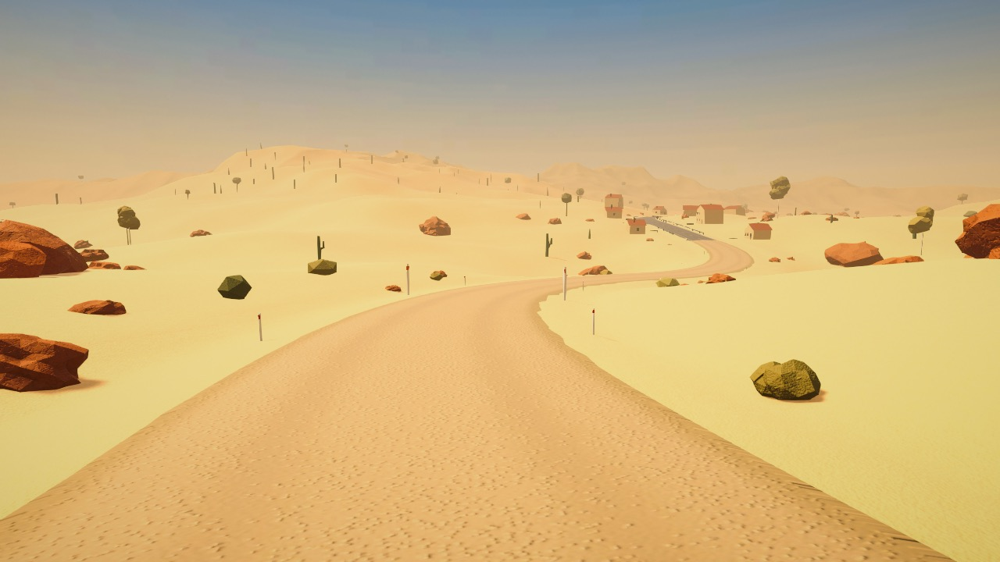

- **Mismo sistema de temas:** `Rally ▸ Build Desert Stage 03 (full)`, o `StageBuilder.BuildDesertFromCommandLine`.
  Los archivos llevan el sufijo `_Desert` y no tocan los otros tramos.
- **Paisaje:**
  - Dunas generadas en el terreno, con la ladera larga a barlovento y la corta a sotavento.
  - Arena, roca arenisca roja y cactus (sustituyen a los pinos en la vegetación).
  - Matorral seco y un pueblo-oasis con un tramo de asfalto viejo.
  - Sin charcos, vallas ni hierba.
- **Recorrido propio** de 2,96 km: ancho y rápido entre las dunas, dos horquillas, arena blanda y tres saltos en crestas de duna.
  Se comprobó antes de generarlo que no se cruza consigo mismo (mínimo 59 m entre partes distintas del recorrido).
- **Tabla de agarre** (`SurfaceDatabase_Desert`):

  | Superficie | Agarre | Resistencia | Polvo |
  |---|---|---|---|
  | Pista de arena dura | 0,93 | 7 | 1,3 |
  | Hamada (roca y grava) | 0,86 | 8 | 1,1 |
  | Arena blanda | 0,68 | 22 | 1,5 |
  | Asfalto viejo | 1,20 | 2,8 | 0,35 |
  | **Arena suelta fuera de pista** | **0,55** | **30** | 1,6 |

  Salirse de la pista cuesta mucho más que en el tramo 1 (hierba: 0,72 / 16).
  El polvo es algo más denso que en tierra (se rebajó un 20–25 % tras probarlo), mantiene el límite de opacidad
  y el 55 % para los rivales, así que el coche de delante sigue viéndose. La IA usa la misma tabla.
- **Ambiente:**
  - Cielo despejado nuevo, con franja de calima en el horizonte.
  - Sol alto y fuerte con sombras marcadas; niebla cálida suave (la mitad de visibilidad a unos 300 m).
  - Motas de polvo y bancos de calima en lugar de lluvia.
  - *Volume* con tonos cálidos: temperatura +16, más contraste y saturación, y *bloom* algo más fuerte.
- **Menú:** las tarjetas de ELIGE TRAMO son más bajas para que los tramos, DIFICULTAD y VOLVER quepan en un móvil en horizontal.

### Tramo 04: costera de asfalto
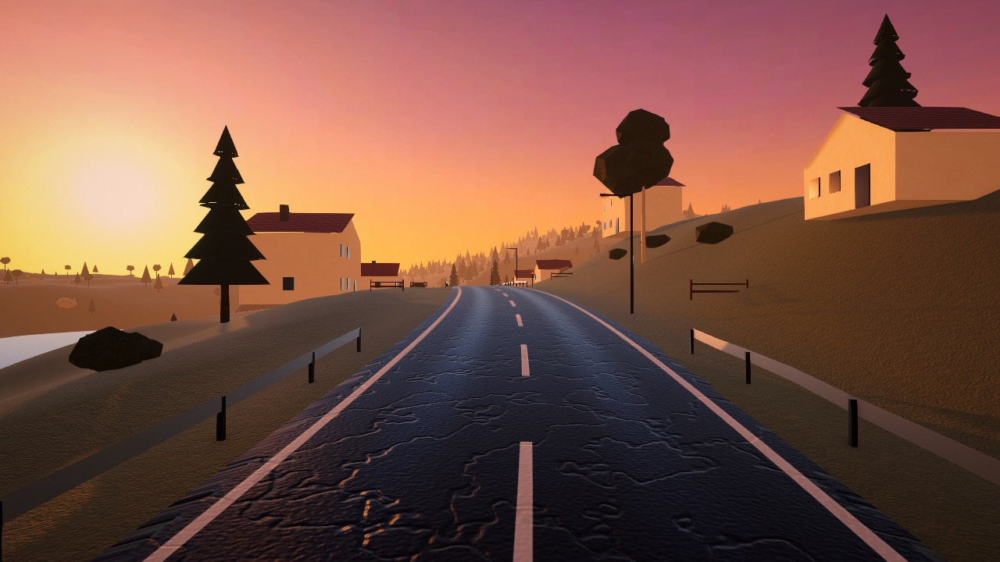

- **Generación:** `Rally ▸ Build Coast Stage 04 (full)`, o `StageBuilder.BuildCoastFromCommandLine`. Sus archivos llevan el sufijo `_Coast`.
- **Recorrido** de 3,48 km, todo en asfalto: curvas largas y rápidas (radios de 110 a 320 m),
  un pueblo de pescadores, una curva a derechas que se cierra sobre el acantilado y una horquilla. Sin saltos.
- **Mucho agarre** (`SurfaceDatabase_Coast`): asfalto nuevo 1,45 (el del pueblo del tramo 1 es 1,3).
  Fuera de la carretera, matorral seco (0,7) y grava en las escapatorias (0,84).
- **Velocidad máxima como reto:**
  - `StageDefinition.topSpeedScale` = 1,15 solo en este tramo.
  - Al coche del jugador (en su copia de ajustes) le sube el limitador de 185 a 213 km/h y le alarga el desarrollo para llegar.
  - Los rivales planifican su velocidad punta un 15 % más alta.
- **Guardarraíles:** en el lado del mar y en el exterior de cada curva, salvo en la salida y la llegada.
- **Farolas:** una cada 60 m, en el lado de tierra, con la lámpara iluminada y *bloom*.
  No llevan luces reales: decenas de luces irían demasiado lentas en la web.
- **Señales de curva peligrosa:** unos 90 m antes de cada curva de radio menor de ~235 m,
  a la derecha y con la flecha hacia el lado de la curva (8 en el tramo).
- **Asfalto** gris medio con líneas pintadas (bordes blancos y línea central discontinua), y menos relieve y brillo que el asfalto viejo.
- **Costa y puesta de sol:**
  - Un lado del mapa baja hasta el mar, con acantilados de caliza; el mar queda siempre por debajo de la carretera.
  - Sol de hora dorada (15°), anaranjado y con sombras largas; cielo de atardecer y niebla ligera rosada.
    Con el sol a 9° las sombras de las colinas dejaban la carretera casi negra en la web.
  - *Volume* cálido: temperatura +20, tinte rosado, más saturación y *bloom* para farolas y sol.
- Pinos mediterráneos menos densos, para que se vean el mar y la carretera. Sin lluvia ni bancos de niebla.
- **Ovejas que cruzan** (`SheepCrossing`, `Sheep`):
  - El generador marca 7 puntos donde la carretera gira menos de 20° en los 100 m anteriores, para que se vea venir.
  - En cada partida cada punto tiene un 30 % de probabilidad, con al menos una oveja por partida (de media, dos).
  - Sale siempre por el lado de tierra. Por el lado del mar hay guardarraíl y la oveja se quedaba detrás sin llegar a cruzar.
  - Modelo reconocible: vellón de bolas de lana, cara negra alargada con hocico, orejas hacia los lados, patas negras y cola.
    Anda con las patas en diagonal y con un colisionador redondeado que sube el escalón del arcén (con uno de caja se quedaba enganchada).
  - La oveja echa a andar cuando te faltan unos 5 s para llegar: está en la carretera cuando llegas,
    pero da tiempo a frenar o esquivarla.
  - **Bala** cada 2–4 s con sonido 3D: solo se oye cuando estás cerca.
  - Si la atropellas, **chilla** y sale despedida en una parábola enorme, hacia delante y muy alto, dando volteretas
    como en los dibujos animados. No rueda por el suelo: deja de chocar y se pierde a lo lejos (a 150 km/h, más de 100 m).
  - Pesa 70 kg: el coche apenas pierde velocidad (de 75 a 67 km/h en el test) y apenas se daña.
    Ahora el daño depende de la masa de lo que golpeas; contra los rivales, que pesan como tu coche, no cambia nada.
  - El balido y el chillido se sintetizan por código, como el resto de sonidos: tono con formantes de vocal «e»
    y el temblor rápido característico.

### Sonido
- Todos los sonidos son **sintetizados por código** (`ProceduralAudio`): motor, turbo, neumáticos, viento, golpes y ambiente.
  Se probó un motor grabado (CC0), pero se retiró a petición: se prefiere el sonido sintetizado original.

### Menú, coches y reglas
- **Menú principal** (`MainMenu`): se construye por código sobre la escena real, con una cámara que gira alrededor del coche (`MenuCamera`).
  La carrera tiene un estado `Menu` previo al título. **SALIR AL MENÚ** recarga el tramo con el menú; **REPETIR TRAMO** lo recarga sin él.
- **Elección de coche** (`CarCatalog`): el jugador se queda la decoración elegida (pintura, colores, número y color en el mapa)
  y el rival que la llevaba recibe la suya. El jugador recibe una **copia propia** de la configuración (`CarTuning`)
  con los ajustes del coche, sin tocar la de los rivales ni el archivo del proyecto (`CarController.ApplyTuning`).
- **Daños** (`CarDamage`, en todos los coches):
  - Se calculan por zonas (delante, detrás, izquierda y derecha) a partir de la velocidad del impacto.
  - **Abolladuras reales** de la malla de la carrocería hacia dentro.
  - **Humo** cuando el frontal está muy dañado.
  - En modo COMPLETOS, **menos potencia** y **tirón de la dirección**. Esto va aparte del multiplicador de potencia que usa la IA.
- **Golpes a los rivales** (`PlayerContactPush`): cuando le das a un rival, recibe un empujón en la dirección del golpe
  (y un giro si le das descentrado) y durante 0,4–1,4 s **pierde el control**: la IA suelta el volante y su ayuda de
  estabilidad baja al 30 %. Antes la IA y la estabilidad lo enderezaban al instante, así que solo te sacaban a ti de la pista.
- **Empujar a baja velocidad** (`PlayerContactPush`, `CarBodyContact`, `AIDriver`): ya no hace falta un golpe.
  - Si estás en contacto y aceleras hacia el rival, se le aplica una fuerza continua (`pushForce` = 5500 N).
  - Mientras le empujas, la IA **cede**: no frena contra ti, gira un 35 % y su estabilidad baja al 60 %.
  - Al dejar de empujar se recupera en 1,2 s (`pushRecoveryTime`).
  - Las carrocerías tienen fricción 0,15 entre sí (antes 0,6 por defecto), así que no se enganchan.
  - Las masas no se tocaron: todos los coches pesan lo mismo. No había `isKinematic` ni control por *waypoints*
    que anulara la física; el problema era que la IA frenaba y corregía al instante.
  - Masas, fuerza de empuje y recuperación son campos públicos, editables en el Inspector.
- **Dificultad** (`DifficultyData`, un *ScriptableObject* en `Assets/Resources/DifficultyData.asset`, editable en el Inspector):
  - Se elige en **ELIGE TRAMO** y en **OPCIONES**, y se guarda con `PlayerPrefs` (`PlayerPrefs.Save()`).
  - Los valores de los rivales multiplican los de cada coche; los del jugador son ayudas sobre su propio coche.
  - DIFÍCIL es el juego tal y como estaba ajustado originalmente.

  | | FÁCIL | NORMAL | DIFÍCIL |
  |---|---|---|---|
  | Ritmo de los rivales | 0,82 | 0,90 | 1,00 |
  | Paso por curva | 0,88 | 0,93 | 1,00 |
  | Velocidad punta / potencia | 0,92 / 0,94 | 0,96 / 0,97 | 1,00 / 1,00 |
  | Errores / temblor del volante | 1,6 / 1,3 | 1,25 / 1,1 | 1,0 / 1,0 |
  | Levantan el pie si te sacan > 60 m (máx. a 250 m) | 22 % | 15 % | 6 % |
  | Agarre del jugador | ×1,10 | ×1,05 | ×1,00 |
  | Frenos / estabilidad del jugador | ×1,15 / ×1,35 | ×1,08 / ×1,15 | ×1,00 / ×1,00 |
  | Control de tracción del jugador | 0,60 | 0,45 | 0,35 |
  | **Tiempo medido del rival más rápido (tramo 01)** | **2:04,2** | **1:53,1** | **1:42,1** |

  Los tiempos se midieron con un test (`DifficultyMeasureTests`) en el que el jugador va justo detrás del líder,
  para que la ayuda de alcance no cuente. Con NORMAL, un jugador medio debería ganar en 2–3 intentos.
  Así un choque no acaba la carrera; a los rivales que van detrás no se les da ventaja.
- **Penalización y parciales:** +5 s por cada reinicio pedido por el jugador; el reinicio automático tras volcar es gratis.
  Los tiempos parciales del mejor recorrido se guardan y se comparan en cada control.
- **Copiloto** (`Pacenotes`, `CoDriver`, `Plugins/WebGL/RallySpeech.jslib`):
  - Las notas se generan a partir de la curvatura del recorrido: grado 1–6 según el radio más cerrado,
    HORQUILLA, LARGA, SE CIERRA, SE ABRE.
  - Los saltos se toman de la definición del tramo.
  - El aviso llega unos 2,6 s antes según la velocidad, y dos notas seguidas se dicen juntas («IZQUIERDA 3 Y DERECHA 4»).
- **Rendimiento en móvil** (`MobilePerformance`): sin desenfoque de movimiento, grano, aberración ni distorsión;
  bloom y antialiasing más ligeros; distancia de dibujado de 900 m (la niebla lo tapa); la mitad de partículas de clima;
  y como mucho 50 ms de física por fotograma.

### Interfaz y juego
- **Menús con mando:** el stick izquierdo mueve la selección igual que la cruceta. Funciona también con mandos que
  el navegador presenta como *joystick* genérico. En cada lista, bajar desde el último botón vuelve al primero y subir
  desde el primero va al último (menú principal, ELIGE TRAMO, OPCIONES y PAUSA).
- **Celebración al ganar** (`Celebration`): si llegas primero contra los rivales, el título pasa a «¡VICTORIA!».
  Suena una fanfarria de metales, con redoble y platillo, seguida de una melodía alegre de victoria.
  Se oyen vítores y aplausos del público, y cae confeti de colores: dos cañones desde las esquinas y luego lluvia desde arriba.
  Todo se genera por código.
- **Límites del mapa** (`MapBounds`): paredes invisibles en el borde del terreno, como en los videojuegos típicos;
  ya no se puede caer al vacío. En la costera, un coche que se mete en el mar vuelve solo a la carretera.
- **Objetos de la cuneta:**
  - Los matorrales (que en el desierto y la costa parecen rocas) y los espectadores ahora son sólidos.
  - Los postes de balizas, los postes de la cinta y las vallas se derriban: salen volando al golpearlos y apenas frenan
    el coche. Si fueran sólidos, un poste de 10 cm lo pararía como un muro.
  - Choques con objetos ligeros: el daño depende de su masa.
- **Doble recarga corregida:** pulsar Enter en resultados con REPETIR seleccionado recargaba el tramo dos veces
  (el botón y la tecla de confirmar). Lo destapó `QA04` al mejorar la navegación con mando.
- **Idioma:** todos los textos en castellano (HUD, menús, avisos, botones y carteles SALIDA / META del escenario).
- **HUD:** *Canvas Scaler* en Scale With Screen Size, 1920 × 1080 y Match 0,5. El nombre del tramo se ajusta solo
  en pantallas 4:3 y 3:2, y los textos de SALIDA / META ya no pisan la barra de progreso.
- **Barra de progreso:** nunca se quitó (el historial de git lo confirma), pero en la nieve y con coches blancos no se veía.
  Ahora tiene una placa oscura detrás, una pista más opaca y marcadores con contorno. Los marcadores se mueven en tiempo real.
- **Cámara a mucha velocidad:** el coche y la carretera se veían lejanos.
  - **Causa principal:** la cámara suavizaba su posición absoluta, y eso la hacía quedarse atrás en proporción a la
    velocidad (unos 3,6 m más a 145 km/h). Ahora suaviza su posición *respecto al coche*, así que va a la misma
    distancia a cualquier velocidad.
  - Además, el campo de visión llega a 66° (antes 74°), la cámara se aleja 0,6 m (antes 1,3 m) y la distorsión se queda en la mitad.
  - La cámara sube hasta 0,5 m para mirar la carretera desde un poco más arriba.
  - Distancia base al coche: 6,2 m (antes 5,6 m), un poco más atrás a petición tras probarla.
  - El oscurecimiento de los bordes a velocidad baja de 0,38 a 0,3.
- **Mirar alrededor** (`RallyCamera`):
  - Con el mando, el **stick derecho** apunta la cámara hacia donde lo inclinas: arriba delante, derecha a la derecha,
    abajo detrás, izquierda a la izquierda, y cualquier punto intermedio. Al soltarlo, la vista vuelve al frente.
  - Q (teclado) y ATRÁS (pantalla táctil) siguen mirando atrás.
  - Los cambios son suaves (unos 0,15 s).
  En las cámaras de persecución la cámara rodea el coche y no atraviesa el suelo ni las paredes.
  El giro se aplica sobre la pose normal de la cámara, así que al soltar no hay saltos.
- **Polvo:** más ligero. Las nubes son más transparentes (55 %) y duran menos (55 %); los rivales levantan el 40 %
  del polvo. Se ajusta en el Inspector, apartado *Visibility* de `CarDustEffects`.

## Pruebas realizadas

### Tests automáticos de Unity
Se ejecutan con `unity test . --mode PlayMode` y `--mode EditMode`, en batch y sin abrir el Editor.

| Test | Qué comprueba | Resultado |
|---|---|---|
| `QA01_ResetAfterCuttingOffRoad…` | Al reiniciar tras salirse, el coche vuelve donde dejó la carretera | ✅ |
| `QA02_ResetOntoAnotherCar…` | Si el punto de reinicio está ocupado por otro coche, busca uno libre | ✅ |
| `QA03_CarOnItsRoof…` | El coche volcado se recupera solo | ✅ |
| `QA04_ConfirmOnResults…` | Enter en la pantalla de resultados recarga el tramo una sola vez | ✅ |
| `QA05_Stage01_IsReadyForAPlayerBuild` | La escena y sus dependencias están listas para un build | ✅ |
| `QA06_PlayerReset_AddsFiveSecondPenalty` | Reiniciar suma 5 s al reloj y al tiempo final | ✅ |
| `QA07_HardFrontalHit_DamagesCarAndReducesPower` | Un choque frontal a 72 km/h daña el coche, quita potencia y abolla la carrocería **hacia dentro** | ✅ |
| `QA08_Pacenotes_CallCornersBothWaysAndTheThreeJumps` | Notas de curva a ambos lados, grados válidos, en orden y los 3 saltos del tramo | ✅ |
| `QA09_CoDriver_CallsTheNextCornerOnScreen` | Al acercarse a una curva, el copiloto muestra la nota correcta | ✅ |
| `QA11_PlayerHitsRival_RivalIsPushedAndStunned` | Al golpear a un rival a 65 km/h, este pierde el control y sale desplazado | ✅ |
| `QA10_SnowStage_UsesSnowGripForCarsAndAI` | El tramo de nieve carga con su tabla de agarre en todos los coches y en la IA, el hielo resbala y hay 3 saltos | ✅ |
| `QA12_LowSpeedPushFromBehind_MovesRivalSmoothly` | Empujando por detrás a un rival a 5 km/h, este pasa de 12 km/h, no sale volando y no se sube encima | ✅ |
| `QA13_LookBack_TurnsCameraRoundSmoothlyAndBack` | Al mantener ATRÁS la cámara mira hacia atrás, vuelve al soltar y nunca gira más de 45° en un fotograma | ✅ |
| `QA14_Terrain_StaysBelowTheRoad` (los cuatro tramos) | El terreno no asoma por encima de la carretera en ~14.000–17.000 puntos por tramo (máx. 0,5 % y 15 cm) | ✅ |
| `QA19_LeftStick_NavigatesMenuAndWrapsRound` | Con un mando virtual, el stick izquierdo recorre el menú de pausa y da la vuelta arriba y abajo | ✅ |
| `QA20_MapEdge_HasInvisibleWalls` | Un coche lanzado a 126 km/h hacia el borde del mapa choca con la pared invisible y no cae | ✅ |
| `QA21_RoadsideProps_CollideOrGetKnockedFlying` | Los espectadores tienen colisión; un poste de baliza sale volando y el coche sigue a más de 43 km/h | ✅ |
| `QA22_Celebration_ConfettiAndMusic` | La celebración lanza más de 150 papelitos de confeti y suena la música | ✅ |
| `QA18_RightStick_LooksInAnyDirection` | El stick derecho mira a la derecha, a la izquierda y atrás, y la vista vuelve al frente al soltarlo | ✅ |
| `QA17_Sheep_CrossesBleatsAndIsKnockedAwayWhenHit` | La oveja cruza la carretera y bala con sonido 3D; al atropellarla a 75 km/h sale despedida, el coche sigue a más de 43 km/h y casi no se daña | ✅ |
| `QA16_CoastStage_FastTarmacWithRailsLightsAndSigns` | Todo asfalto con agarre ≥ 1,4; limitador del jugador por encima de 200 km/h; señales de curva, farolas y guardarraíles; el mar por debajo de la carretera; sin lluvia ni saltos | ✅ |
| `QA15_DesertStage_UsesSandGripAndLooseSandOffRoad` | El desierto carga su tabla en coches e IA; la arena suelta agarra mucho menos y frena más; hay polvo denso, no llueve y hay 3 saltos | ✅ |
| `Measure_RivalStageTimes_PerDifficulty` (manual, *Explicit*) | Mide el tiempo de los rivales en cada dificultad | — |

Se pasaron después de cada cambio (25 en total: 24 de PlayMode, contando QA14 una vez por tramo, y 1 de EditMode).
Hay dos pruebas manuales (*Explicit*): la medición de tiempos por dificultad y `SheepCrossing_Screenshots`, que renderiza una oveja cruzando para revisarla.
`QA04` falla de vez en cuando justo después de una recompilación y pasa al repetirlo, así que parece intermitente.
`QA08` detectó que la primera versión del detector de saltos (por el perfil de altura) solo encontraba 1 de los 3;
ahora los saltos se toman de la definición del tramo.

### Compilación del código web
Unity no compila los bloques `#if UNITY_WEBGL && !UNITY_EDITOR` al ejecutar los tests en el Editor.
Por eso se compilaron aparte con el compilador de Unity (Roslyn), con los *defines* de web y los de macOS. Resultado: **0 errores**.

### Pruebas en el navegador (Chrome automatizado con CDP)
- **PC (1280 × 720):**
  - Carga del build.
  - Empezar con Enter o con clic.
  - Pausa con Esc y con P; menú de pausa sin botón SALIR; botón CONTINUAR con el ratón.
  - Pausa al perder el foco.
  - Conducción y capturas del HUD.
- **Audio:** se instrumentó el Web Audio del navegador (fuentes creadas, ganancia y nivel de señal por nodo).
  Así se localizó el fallo de los coches: los canales tenían ganancia 0,38 pero salida 0.
  Tras la corrección, la señal de los coches pasó de 0 a 0,10–0,39.
- **Android simulado** (agente de usuario Android, pantalla táctil, 915 × 412 en horizontal, acelerómetro simulado):

| Escenario | Resultado |
|---|---|
| Sensor normal | Giro en los dos sentidos (±0,38 con ±22°) |
| El navegador responde «prompt» a la API de permisos | La inclinación funciona igualmente |
| `requestPermission` rechaza el permiso (como en Chrome reciente) | La inclinación funciona igualmente |
| Solo `deviceorientation`, sin acelerómetro | Gira en el mismo sentido que con acelerómetro (±0,37) |
| Sin sensores | Aparecen IZQUIERDA / DERECHA a los 2 s y giran |
| Modo MANDO | A acelera hasta ~78 km/h; el joystick gira a derecha e izquierda |
| Pedal táctil ACELERAR | ~100 km/h en recta |

- **Menú y reglas, en PC (1280 × 720):**
  - Recorrido completo: menú → controles → opciones → elegir coche → cambiar a AZUR → empezar → carrera
    → pausa → SALIR AL MENÚ → de vuelta al menú con el coche elegido.
  - Choque real (acelerando sin girar): barra de daños, humo y **+5 s PENALIZACIÓN** al pulsar R.
  - Copiloto: «IZQUIERDA 5 · LARGA» antes de la primera curva.
- **Barra, dificultad y mirar atrás (PC y móvil simulado):** selector DIFICULTAD en ELIGE TRAMO; barra visible en el tramo de nieve
  con el marcador del rival avanzando; Q gira la cámara hacia atrás y vuelve al soltar; en el móvil, el botón ATRÁS hace lo mismo.
- **Menú en el móvil simulado:** las opciones caben en una pantalla horizontal. Con **ACELERAR SOLO**, el coche va a 116 km/h sin tocar ningún pedal.
- **Fallos encontrados gracias a estas pruebas y ya corregidos:**
  - La elección de coche se perdía al usar REPETIR TRAMO o al volver al menú.
  - Las flechas ↑ ← → no existen en la fuente web.
  - El panel de información tapaba el coche en la pantalla de elección.
  - El botón VOLVER de Opciones se salía de la pantalla en el móvil.
  - ACELERAR SOLO no se aplicaba si se activaba desde el menú.
  - Eje de inclinación mal interpretado en horizontal: el volante se quedaba a tope y el coche no avanzaba.
  - El plugin esperaba un permiso que Chrome para Android nunca concede antes de escuchar el sensor (código 32 en el diagnóstico).
  - El botón MANDO no se podía pulsar en la pantalla de título.
  - Solapes del HUD al traducir al castellano.

### Tamaño y carga en la web
Medido con el build anterior a los recortes, con la caché vacía:

| Conexión | Hasta que el juego arranca |
|---|---|
| Red local | 10,9 s |
| 20 Mbps | 23,6 s |
| 10 Mbps | 44,3 s |

El terreno de cada tramo ocupaba 19,8 MB, el 78 % del contenido. Recortes aplicados (en `TerrainBuilder`, `TextureBaker` y `ProjectSetup`):
- **Terreno:** mapa de alturas de 2049 a 1025, pintura de 1024 a 512 y hierba de 1024 a 512 (misma densidad por m²).
  Cada tramo pasa de **20 MB a 5,3 MB**. En la nieve ya no hay hierba (apenas se veía).
- **Mapas de relieve (*normal maps*):** los dos tramos comparten el mismo archivo, porque eran idénticos
  (se han borrado 19 copias `_N_Snow`). Los de la carretera van a 512 px solo en la versión web.
- **Pantalla de inicio de Unity:** desactivada.

`QA14` comprueba que el terreno, con menos resolución, sigue por debajo de la carretera. Con 1025 muestras asoma en 6 de ~27.000 puntos, como mucho 9 cm y en el borde de la calzada.
Bajar más el lecho de la carretera lo evitaba, pero dejaba ver más el arcén y cambiaba el aspecto del tramo, así que se dejó como estaba.
**Resultado medido con el build final (4 tramos):** 41,6 MB frente a 51,4 MB con 2 tramos.
Paquete de datos: 31 MB (antes 40 MB); código `wasm`: 11 MB.

| Conexión (caché vacía) | 2 tramos, antes | 4 tramos, con recortes |
|---|---|---|
| 20 Mbps | 23,6 s | **19,0 s** |
| 10 Mbps (Android emulado) | 44,3 s | **36,4 s** |

Con el doble de tramos carga más rápido y cumple los 30 s a 20 Mbps. En un 4G flojo (10 Mbps) sigue por encima.
Para bajar de ahí haría falta cargar cada tramo al elegirlo (Addressables).

### Pendiente de verificar en dispositivos reales
- **iPhone / iPad:** no se ha probado el permiso de movimiento de Safari.
- **Mando físico en el navegador:** el mapeo existe (también el stick derecho para mirar alrededor), pero no se ha probado con un mando conectado.
- **Rendimiento en móviles de gama baja.**
- **Sensibilidad de la inclinación:** cuál de los cuatro niveles se nota mejor con el móvil en la mano.
- **Voz del copiloto:** depende de las voces que tenga instaladas el navegador o el sistema; si no hay voz en castellano, lee con la voz por defecto.
- **Mejor tiempo en PC nativo:** se pierde el guardado anterior al cambiar el nombre del producto a «Tramo 01».

## Regenerar el tramo

`Rally ▸ Build Stage (full)` reconstruye desde código las texturas, materiales, prefabs, el terreno y la escena.
Antes, ajusta los assets de datos de `Assets/Settings/Rally`:

- **`Stage01` (`StageDefinition`):** tramos del recorrido, anchos, superficies, saltos, forma del terreno y controles.
- **`CarTuning`:** motor, caja de cambios, frenos, dirección, suspensión, neumáticos y ayudas.
- **`SurfaceDatabase`:** agarre, resistencia, polvo, piedras y sonido de cada superficie (tierra, grava, barro, asfalto, hierba).

En modo batch: `Unity -batchmode -projectPath . -executeMethod Rally.EditorTools.StageBuilder.BuildFromCommandLine`

## Estructura del código (`Assets/Scripts`)

- **`Car/`** (incluye `CarDamage`: daños y abolladuras):
  - `CarController`: física con WheelCollider y ayudas.
  - `CarDrivetrain`, `CarWheel`, `CarBodyMotion`, `CarFeedback`, `CarTuning`.
  - `PlayerCarInput`: teclado, mando, inclinación, controles táctiles y ayuda a alta velocidad.
- **`Camera/`:** `MenuCamera` (cámara giratoria del menú) y `RallyCamera`, con cámara de persecución, FOV, inclinación, vibración, evitación del terreno y vistas de capó y paragolpes.
- **`Track/`:** `Pacenotes` (notas del copiloto), `TrackPath`, `Checkpoint`, `StageDefinition`, `TerrainSurfaceMap` y `Generation/` (recorrido, esculpido del terreno, malla de la carretera).
- **`AI/`:** `AIDriver`, con *pure pursuit*, perfil de velocidad según la curvatura, errores y recuperación.
- **`Systems/`:** `RaceManager`, `RaceParticipant`, `RallyInput`, `CarCatalog` (coches elegibles), `MobilePerformance`, superficies,
  `GameBootstrap` y utilidades de mallas y ruido procedurales.
- **`UI/`:** `MainMenu`, `RaceHUD`, `StageMenus`, `CoDriver`, `UIFactory`, `TouchControls`, `TouchPedal`, `TouchJoystick`.
- **`Audio/`:** `CarAudio`, `StageAudio` y `ProceduralAudio` (síntesis provisional; se pueden asignar clips reales).
- **`VFX/`:** polvo y piedras, marcas de derrape, clima y postprocesado según la velocidad.
- **`Editor/`:** el generador del tramo, las fábricas de assets y `WebBuild` (build web por línea de comandos).
- **`Plugins/WebGL/`** (en `Assets/`): `RallyMotion.jslib` (sensores de movimiento) y `RallySpeech.jslib` (voz del copiloto).
